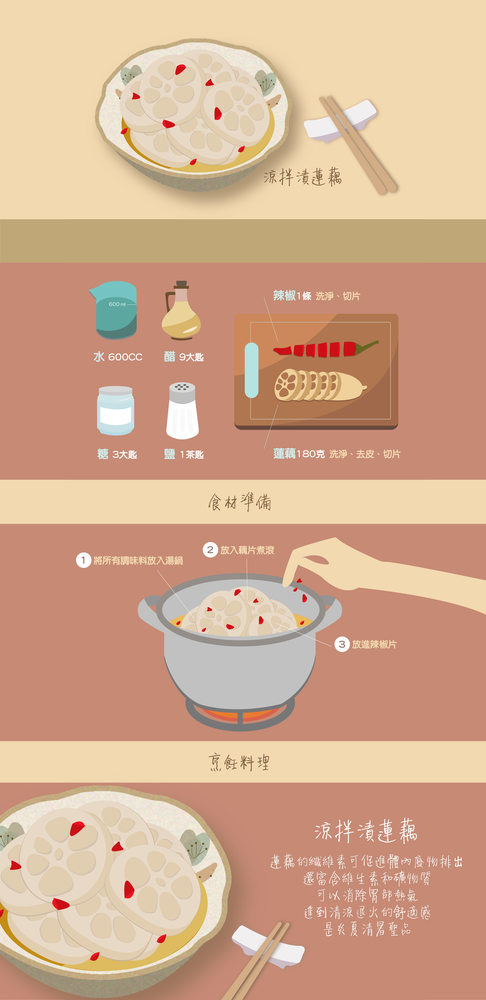

# Recipe
<html>
<head>
<title>網頁檔</title>
<meta http-equiv="Content-Type" content="text/html; charset=big5">
</head>
<body bgcolor="#FFFFFF" leftmargin="0" topmargin="0" marginwidth="0" marginheight="0">

</body>
</html>
